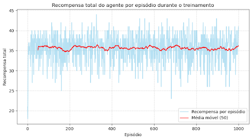
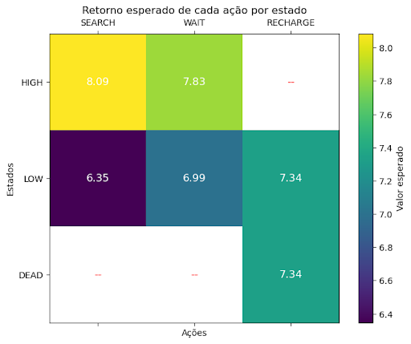
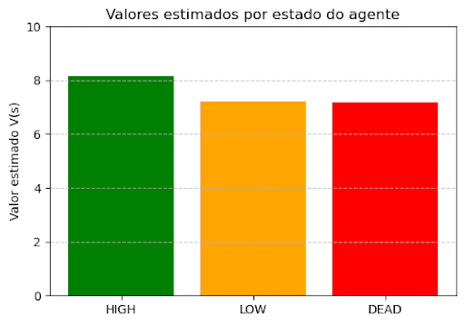
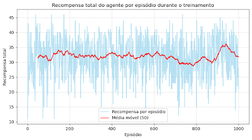
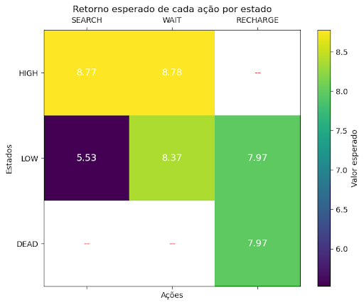
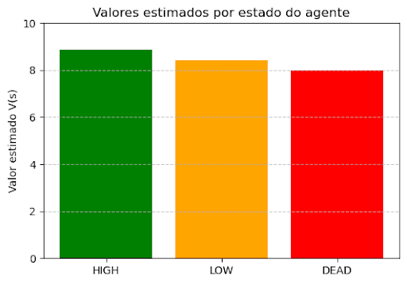
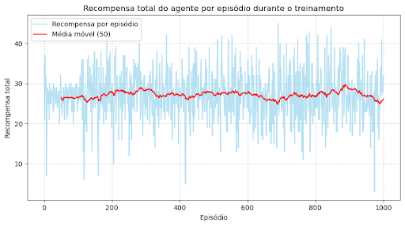
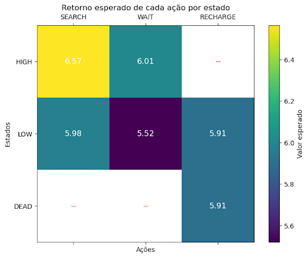
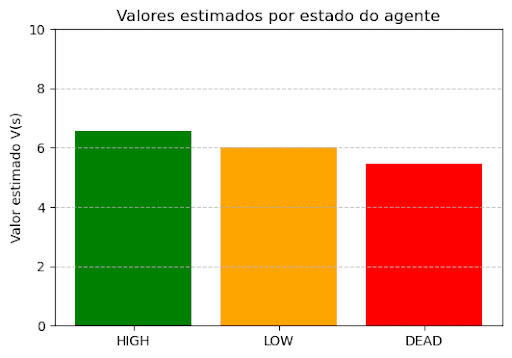

## Relatório Recycling Bot

Grupo: Heitor Trielli e Francisco Kuchpil

Aprendizado por reforço

# **DESCRIÇÃO DO CÓDIGO:**

## **Definição do problema e parâmetros do agente:**

Para treinar um agente capaz de escolher uma política ótima para o problema do Recycling Robot, primeiro foi necessário definir esse problema para o algoritmo. Para fazer isso, começamos definindo todas as ações possíveis (Search, Wait e Recharge), e todos os estados possíveis (high_battery, low_battery e dead_battery).

Depois, escolhemos as probabilidades de mudança de estado do sistema segundo cada ação. Especificamos a probabilidade do robô continuar com bateria alta após explorar com a bateria alta como alfa (e portanto a probabilidade do sistema ir de bateria alta para bateria baixa após explorar é 1- alfa). Além disso, especificamos a probabilidade beta do robô continuar com a bateria baixa após explorar com bateria baixa (e portanto a probabilidade do sistema ir de bateria baixa para sem bateria após explorar é 1 - beta). Depois, definimos as recompensas de cada ação, seguindo a especificação do problema, em que a recompensa de sair do estado de low_battery para dead_battery é -3. Além disso, modelamos a recompensa de achar uma lata como 1, sendo r_search e r_wait sendo interpretado como a probabilidade de achar uma lata caso o robô decida procurar ou esperar respectivamente.

Posteriormente escolhemos um epsilon para uma futura política epsilon-greedy que nosso agente vai aplicar. Além disso, especificamos o fator de desconto Q, que o agente vai usar para levar em consideração possíveis recompensas futuras de acordo com suas ações, mas dando menos importância para as possíveis recompensas quanto mais no futuro elas estiverem.

Além disso, colocamos o agente para imprimir seus resultados a cada 50 passos, para que possamos monitorar seu aprendizado, e restringimos o problema a ter uma quantidade finita de passos, já que ele não tem um estado final. Depois de criar todas essas variáveis, criamos três classes para definir o problema.

Uma última observação é que decidimos adicionar duas features além do proposto no livro: uma depreciação e adicionar o estado dead_battery explicitamente. A depreciação serve para que o robô dê um peso maior a recompensas imediatas, e a adição do dead_battery traz um passo físico explicito entre a bateria morrer e o robô ser recarregado. Podemos emular o problema inicial fazendo o valor do desconto ser 1 e fazendo o search com bateria fraca mudar o estado para high com retorno -3, em vez de mudar para dead_battery com retorno -3

## **Definindo a classe RobotState:**

Classe que representa o que o agente entende como ambiente. No caso do problema, o estado do robô. Para ela, definimos as seguintes funções:

1) \_\_init\_\_: Função de inicialização da classe. Cada vez que criamos um robot state sorteamos dois números aleatórios em [0,1). O primeiro deles, deplete_rng será usado para verificar se o robô mudou de estado a partir de sua ação, seguindo a probabilidade disso acontecer. O segundo deles, reward_rng será usado para verificar se o robô recebeu uma recompensa a partir de sua ação, seguindo a probabilidade disso acontecer.

2) hash: Função usada para criar um identificador único do estado (de acordo com o nível de bateria).

3) get_valid_actions: Define quais ações o agente pode escolher de acordo com seu estado de bateria, como especificado pelo problema. Assim, se a bateria estiver alta ele pode escolher esperar ou procurar, e assim por diante.

4) next_state: Define o próximo estado do robô a partir de seu atual estado e a ação que ele decidiu tomar. O estado do robô muda de acordo com as probabilidades alfa e beta definidas anteriormente.

5) get_reward: Atribui a recompensa dada ao robô para uma determinada ação, de acordo com a probabilidade da ação ser bem sucedida e a recompensa (estabelecida previamente) para o sucesso ou fracasso de cada ação.

## **Definindo a classe RobotAgent:**

Depois, definimos a classe RobotAgent, que é o agente de aprendizado por reforço que interage com o ambiente (RobotState). Para ela, temos as seguintes funções principais:

1) \_\_init\_\_: Função de inicialização da classe. Nela incluímos os parâmetros de aprendizado (taxa de aprendizado, exploração na política epsilon-greedy, fator de desconto) e iniciamos estimativas arbitrárias para o valor de cada estado, a serem atualizadas pelo aprendizado.

2) update_model: Função que atualiza o modelo aprendido do ambiente de acordo com a experiência, ou seja, registra quantas vezes cada par (estado, ação) levou a determinados próximos estados e quais recompensas foram recebidas por essas transições.

3) get_expected_value: Função que calcula o valor esperado do par estado ação, para informar qual a melhor decisão (pelo que o modelo aprendeu) em um determinado momento.

4) backup: Função que atualiza o valor de cada estado, usando o método de diferença temporal.

5) act: Escolhe a ação que o agente vai ter, de acordo com a política epsilon-greedy, ou seja, com probabilidade epsilon seleciona uma ação aleatória (exploration) e, com probabilidade 1−epsilon, seleciona a ação de maior valor estimado (explotation).

6) print_policy: Imprime a tabela com os valores esperados de cada ação em cada estado, estabelecendo uma hierarquia entre as ações de acordo com as estimativas de ganho através delas aprendidas pelo agente.

## **Definindo a classe CanCollectionJudger:**

Temos também a classe CanCollectionJudger, que serve como controladora do ambiente e coordenadora da interação agente-ambiente. Para ela temos as seguintes funções:

1) \_\_init\_\_: Função que recebe o agente como parâmetro, e inicializa o estado atual, contador de passos e recompensa total do episódio.

2) reset: Função que prepara um novo episódio do jogo do robô, inicializando ele com a bateria alta, e zerando os contadores de recompensa e passos.

3) play_episode: Função que cria o loop de jogo do agente, a ser iterado pelo número de passos máximos. Nele o agente escolhe a ação de acordo com a política epsilon-greedy, o ambiente retorna a recompensa pela ação e o novo estado, o modelo do ambiente do agente e seu histórico é atualizado de acordo com isso, e o número de passos e recompensas do episódio são registrados para retorno no fim do episódio.
 

## Definindo a função de treino

Por fim, temos a função de treino:

train: a função que treina o modelo, controlando a interação do robô com o ambiente seguindo o controlador do ambiente.    

# **RESULTADOS OBTIDOS**:

Depois de programar o código para modelar o problema, resolvemos testá-lo com três conjuntos de parâmetros diferentes, usando o matplotlib para visualizar os resultados. Usamos os parâmetros do sistema fixos epsilon = 0.3, taxa de aprendizado = 0.1, número de passos de cada jogo = 50 e 1000 jogos para realizar o treino.

## **Parâmetros do jogo mudados para testar o programa:**

**Parâmetros de probabilidade de mudança de estado dada uma ação:**

1) Alpha: Probabilidade do robô continuar no estado HIGH_BATTERY se ele escolher explorar nesse estado.

2) Beta:  Probabilidade do robô continuar no estado LOW_BATTERY se ele escolher explorar nesse estado

**Recompensas:**

1) Reward_search: Recompensa do robô por explorar

2) Reward_wait: Recompensa do robô por esperar uma lata chegar a ele

O problema restringe Reward_search > Reward_wait.
Além disso, a recompensa por recarregar é sempre 0 e a recompensa por descarregar completamente é sempre -3.

## **Exemplo 1:**
Alpha = 0.7, 
Beta = 0.7, 
Reward_search = 1, 
Reward_wait = 0.5

**Resultados:**

**Interpretação:** Julgamos que o problema é muito simples, e portanto o aprendizado do sistema é realizado já nas primeiras iterações do treino, e depois o retorno flutua pela estocasticidade do problema, e pela decisão ser aleatória com probabilidade 0.3. 

Com as condições que definimos, é natural que a escolha ótima para o estado low seja carregar, pois apesar da probabilidade de ir de low para dead procurando não ser muito grande (0.3), a penalidade de ir para dead é muito maior do que a recompensa por procurar. Além disso, a recompensa por esperar é baixa relativa a de procurar, e portanto não vale a pena receber a recompensa por esperar e continuar não procurando.

É natural que os valores estimados para os estados low e dead sejam iguais, já que a decisão ótima para os dois estados é carregar (e portanto, geram a mesma recompensa com a mesma probabilidade). E, obviamente, o valor estimado para o estado com a bateria cheia é o maior, já que ele permite mais ações com boas recompensas.

## **Exemplo 2:**
Alpha = 0.5, 
Beta = 0.3, 
Reward_search = 1, 
Reward_wait = 0.8

**Resultados:**

**Interpretação:** Novamente, julgamos que o problema é muito simples, e portanto o aprendizado do sistema é realizado já nas primeiras iterações do treino, e depois o retorno flutua devido às probabilidades associadas às ações. 

Com as condições que definimos, faz sentido que a melhor decisão no estado low seja esperar, pois a recompensa associada a esperar é quase igual à recompensa de procurar, e portanto não vale a pena para o agente “perder tempo” carregando. Além disso, a punição por descarregar é muito grande comparada com a recompensa de procurar, então faz sentido que procurar seja a pior decisão possível no estado low. 

Faz sentido que o valor estimado de low seja maior que o de dead, pois o dead precisa “perder um tempo” carregando, e demora mais até ganhar uma recompensa. Novamente o melhor estado é o high, que permite procurar e esperar com retornos esperados muito parecidos. 

## **Exemplo 3:**
Alpha = 0.3, 
Beta = 0.9, 
Reward_search = 5, 
Reward_wait = 0.1

**Resultados:**

**Interpretação:** Novamente, julgamos que o problema é muito simples, e portanto o aprendizado do sistema é realizado já nas primeiras iterações do treino, e depois o retorno flutua.

Com essas condições, a recompensa por explorar é tão alta que o agente aprende a explorar mesmo no estado low, arriscando ser punido por acabar a bateria. A recompensa por esperar é muito baixa, e assim o retorno esperado por carregar em low e dead é muito parecido ao retorno de esperar em high. Assim, o retorno esperado de wait em low é o menor de todos. 

Novamente o estado low vale mais que dead, pois o retorno esperado por carregar (única ação em dead) é menor que o retorno de uma ação em low (no caso, explorar). Como nos outros casos, high é o estado com o maior valor associado.

